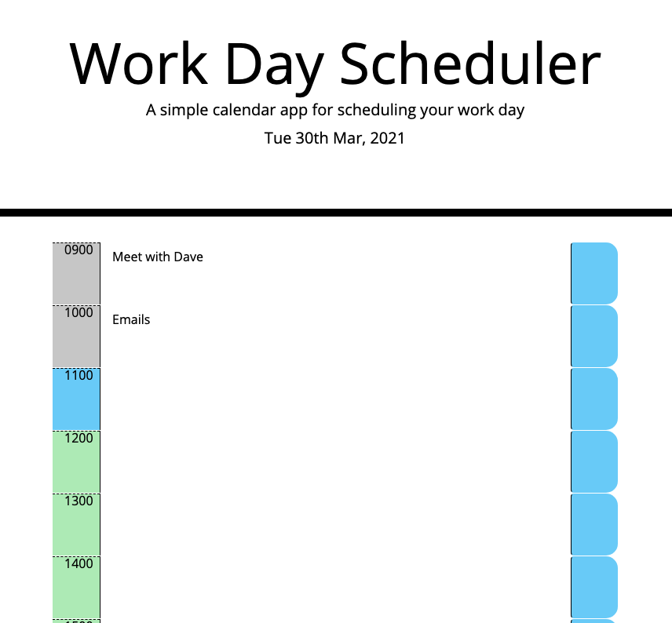
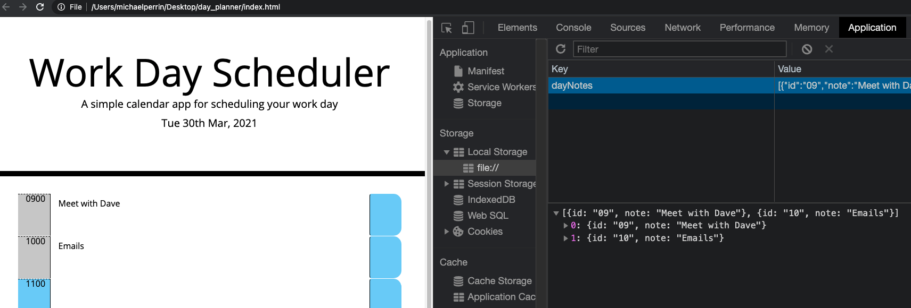

# Day Planner

A simple calendar application that allows a user to save events for each hour of the day.

AS AN employee with a busy schedule
I WANT to add important events to a daily planner
SO THAT I can manage my time effectively

# Acceptance Criteria

GIVEN I am using a daily planner to create a schedule

WHEN I open the planner
THEN the current day is displayed at the top of the calendar

WHEN I scroll down
THEN I am presented with timeblocks for standard business hours

WHEN I view the timeblocks for that day
THEN each timeblock is color coded to indicate whether it is in the past, present, or future

WHEN I click into a timeblock
THEN I can enter an event

WHEN I click the save button for that timeblock
THEN the text for that event is saved in local storage

WHEN I refresh the page
THEN the saved events persist

# Features

## Planner Screen

Planner screen that displays the current date and renders any previously saved notes.

## Rolling Time Blocks

Time blocks that change colour depending on if the time slot is past, present or future.

* Gray = Past
* Blue = Present
* Green = Future

## Save Button

Save button that stores the data in local storage, or updates the data if changes are made and saved.

Once saved is clicked, displays a message to user notifying that their save was successful.

# Link to Git Hub

https://github.com/mp2626/day_planner

# Link to Site

https://mp2626.github.io/day_planner/

# Programming Languages

* HTML
* CSS
* JavaScript

# Authors
Sydney Uni
Contributor - David Impey - Instructor
Contributor - Sandes - TA
Contributor - Michael Perrin
